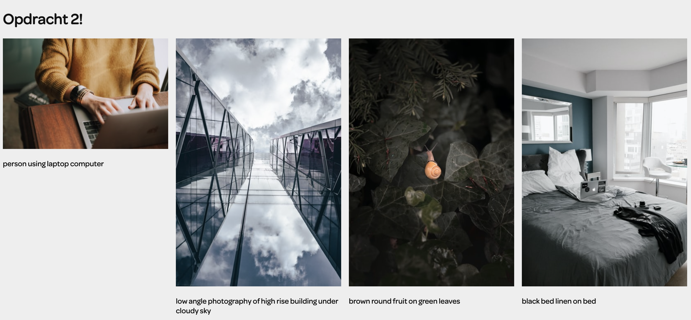

<!-- prettier-ignore-start -->
# Procesverslag

**Auteur:** Ravi Stil

**Het werk:** [opdracht 1](opdracht1/index.html) en [opdracht 2](opdracht2/index.html)

Markdown cheat cheet: [Hulp bij het schrijven van Markdown](https://github.com/adam-p/markdown-here/wiki/Markdown-Cheatsheet). Nb. de standaardstructuur en de spartaanse opmaak zijn helemaal prima. Het gaat om de inhoud van je procesverslag. Besteedt de tijd voor pracht en praal aan je website.

## Bronnenlijst

1. -Clippy — CSS clip-path maker. (z.d.). Clippy — CSS clip-path maker. https://bennettfeely.com/clippy/-
2. -Mastercard NL. (z.d.). Mastercard. https://www.mastercard.nl/nl-nl.html-
3. -Canon Netherlands, C. (z.d.). Home. Canon Netherlands. https://www.canon.nl/-

## Je 'posts' (je code-dagboek)

Je procesverslag is een soort dagboek.
Bij elk voortgangsgesprek en het eindgesprek voeg je een ‘post’ aan je dagboek toe.

In zo’n ‘post’ neem je op:

- Wat je van plan was
- Je werk zo ver
- Wat er goed ging
- Wat er lastig is
- Wat je plannen zijn

### Voortgangsgesprek 1 - 21-04-2021

#### Wat ik van plan was:
Deze week was ik van plan om de twee storyboards helemaal af te hebben om te kunnen beginnen aan het coderen van de animatie. Ook wilde ik alvast de juiste kleuren en lettertypes verzamelen om aan de slag te kunnen.

#### Mijn werk zo ver:
Tot nu toe heb ik de volgende twee storyboards ontworpen.

Storyboard 1:

Storyboard 2:

#### Wat ging er goed:
Het bedenken wat de Storyboarden ging goed en ik denk dat beide storyboards wel te realiseren zijn.

#### Wat er lastig is:
Ik heb wel met twijfels bij het 2e storyboard aangezien ik daar in het storyboard nu een SVG van een camera heb gebruikt. Dat mag uiteindelijk niet dus ik moet even kijken welke oplossing ik daar voor kan gaan vinden.

#### Wat zijn mijn plannen:
Voor de volgende keer wil ik een stuk verder zijn met Storyboard 1 en wil ik hier al echt een goede opzet van gemaakt hebben die ook goed werkt. Ook wil ik alvast beginnen aan het 2e Storyboard voor de volgende keer.

### Voortgangsgesprek 2 - 28-04-2021

#### Wat ik van plan was:
Deze week was ik van plan om te beginnen met Animatie 1 van (Mastercard). Hierbij wilde ik de balletjes laten stuiteren door het beeld heen. Ook was mijn plan om zover mogelijk te komen met de animatie van Mastercard en daarna door te gaan met de animatie van Canon.

#### Mijn werk zo ver:
Tot nu toe heb ik het voor elkaar gekregen om de twee circles van Mastercard door het beeld te laten stuiteren. Dit gaat nog niet helemaal soepel maar tijdens het voortgangsgesprek wil ik vragen hoe dit wat natuurlijker kan overkomen. Ik ben nog niet begonnen aan de animatie van Canon.

#### Wat ging er goed:
Het opzetten van de algemene stijlen en het alvast indelen van de twee vlakken (sections) waar de animaties in komen ging erg goed. En het laten stuiteren van de circles is ook wel aardig gelukt alleen kan dit nog wel wat soepeler en natuurlijker.

#### Wat er lastig is:
Afgelopen week heb ik niet heel veel kunnen doen waardoor ik even hard door moet werken aan beide animaties. Volgende week is er meivakantie dus heb ik even tijd om er veel aan te zitten.

#### Wat zijn mijn plannen:
Voor de volgende les is het de bedoeling dat beide animaties af zijn en op Github staan zodat ik deze kan presenteren tijdens de les. Het plan is dus om dit helemaal af te krijgen in de mei vakantie. Ik wil ik de Dark Mode werkend krijgen en custom css properties gaan gebruiken voor de kleuren.

### Voortgangsgesprek 3 (Presentatie opdracht 1) - 11-05-2021

#### Wat ik van plan was:
Ik was van plan om voor de presentatie beide animaties helemaal af te hebben en de code op Github te zetten. Ook was ik in de vakantie van plan om de Mastercard animatie iets te gaan veranderen waardoor het meer een relatie heeft met Mastercard. Verder was ik nog van plan om de Dark Mode uit te werken en dat is ook goed gelukt.

#### Mijn werk zo ver:
De beide animaties zijn helemaal af en op Github geplaatst. Ik heb de Mastercard animatie iets aangepast waardoor de animatie nu iets meer relatie heeft met het merk. Er is nu namelijk eerst een betaalpas te zien en daarna komt het logo met de letters. Ook de Canon animatie is helemaal af en deze is ook goed gelukt. Verder heb ik gewerkt met custom css properties voor de kleuren waardoor ik ook de Dark Mode werkend heb kunnen krijgen.

#### Wat ging er goed:
Eigenlijk ging er heel veel best goed. Het veranderen van de animatie van Mastercard vond ik erg goed gaan omdat deze nu veel beter is vind ik. Ook de animatie van Canon is erg goed gelukt en het lukte best snel om deze in elkaar te zetten. Ook de Dark Mode is goed gegaan.

#### Wat er lastig is:
Wat ik lastig vond was om de Dark Mode ook handmatig te laten werken dat deze op de website zelf met een toggle aan en uit te zetten is. Dit is mij ook niet meer gelukt maar het werk wel natuurlijk als er in het systeem Dark Mode aangezet wordt.

#### Wat zijn mijn plannen:
Mijn verdere plannen zijn om te gaan beginnen met opdracht 2 en als dat nodig is wat feedback nog te verwerken van opdracht 1.

### Voortgangsgesprek 4 (Opdracht 2) - 26-05-2021

#### Wat ik van plan was:
Ik was van plan om te beginnen met een koppeling te maken met een API waar ik fotografie uit kan halen. Na wat online zoeken ben ik
uitgekomen op de API van Unsplash. Verder was ik ook van plan om uit deze API al wat content te kunnen halen zoals de afbeeldingen zelf bijvoorbeeld. Dit is ook gelukt:

#### Mijn werk zo ver:
Zoals ik eigenlijk hierboven al benoem heb ik de koppeling met de API van Unsplash kunnen maken. Hier even een afbeelding waarin ik 
laat zien dat het gelukt is:

Afbeelding uit API unsplash 1:

#### Wat ging er goed:
De API koppeling is uiteindelijk goed gelukt en dit is ook vrij goed gegaan. Zelfs de API KEY authorisatie is goed gegaan.

#### Wat er lastig is:
Ik heb ook geprobeerd om met andere API's te werken maar dat is toch soms best lastig. Veel deden het niet helemaal goed of kreeg ik
een Error. Gelukkig is het bij de Unsplash API wel helemaal goed gelukt. Ook liep ik hier een beetje vast op waardoor ik niet veel meer heb kunnen doen.

#### Wat zijn mijn plannen:
Mijn verdere plannen zijn om nog even goed na te gaan denken welke functionaliteiten ik precies wil en dan wil ik gaan beginnen aan het filter systeem. Dit wordt best een behoorlijke uitdaging maar ik denk dat het wel gaat lukken.
<!-- prettier-ignore-end -->
