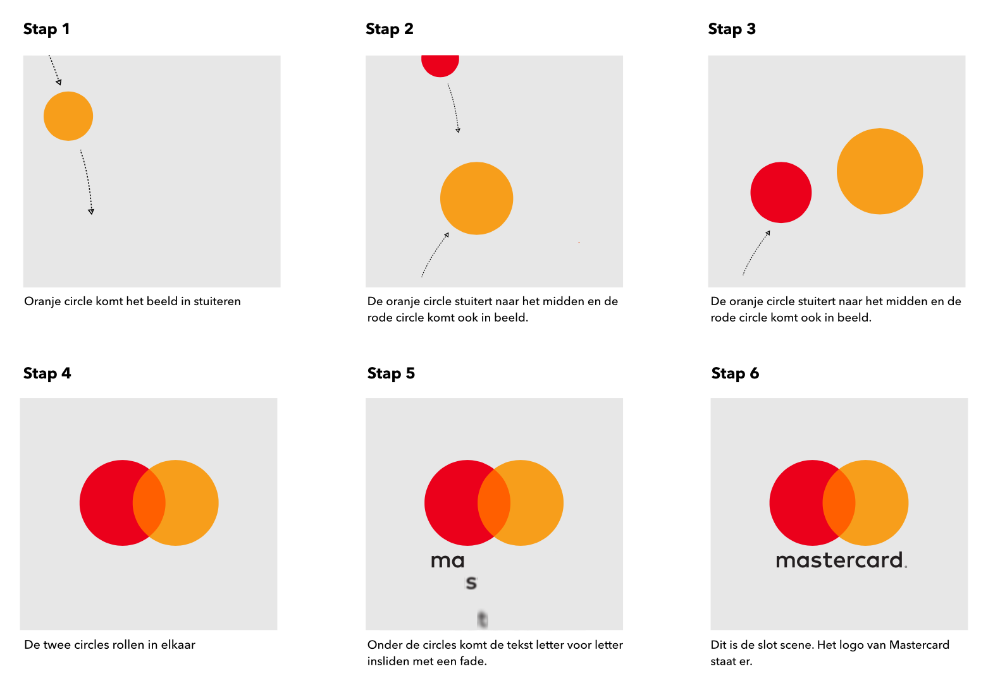
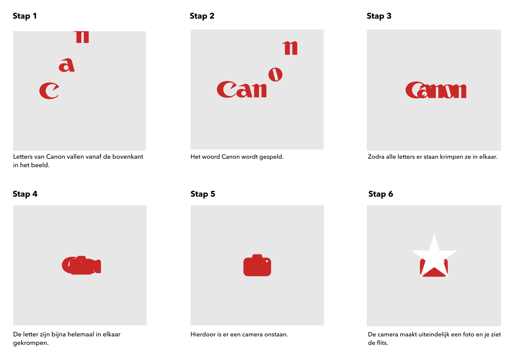

<!-- prettier-ignore-start -->
# Procesverslag

**Auteur:** Ravi Stil

**Het werk:** [opdracht 1](opdracht1/index.html) en [opdracht 2](opdracht2/index.html)

Markdown cheat cheet: [Hulp bij het schrijven van Markdown](https://github.com/adam-p/markdown-here/wiki/Markdown-Cheatsheet). Nb. de standaardstructuur en de spartaanse opmaak zijn helemaal prima. Het gaat om de inhoud van je procesverslag. Besteedt de tijd voor pracht en praal aan je website.

## Bronnenlijst

1. -bron 1-
2. -bron 2-
3. -...-

## Je 'posts' (je code-dagboek)

Je procesverslag is een soort dagboek.
Bij elk voortgangsgesprek en het eindgesprek voeg je een ‘post’ aan je dagboek toe.

In zo’n ‘post’ neem je op:

- Wat je van plan was
- Je werk zo ver
- Wat er goed ging
- Wat er lastig is
- Wat je plannen zijn

### Voortgangsgesprek 1 - 21-04-2021

#### **Wat ik van plan was:**
Deze week was ik van plan om de twee storyboards helemaal af te hebben om te kunnen beginnen aan het coderen van de animatie. Ook wilde ik alvast de juiste kleuren en lettertypes verzamelen om aan de slag te kunnen.

#### **Mijn werk zo ver:**
Tot nu toe heb ik de volgende twee storyboards ontworpen.

Storyboard 1:

Storyboard 2:

#### Wat ging er goed:

#### Wat er lastig is:

#### Wat zijn mijn plannen:
<!-- prettier-ignore-end -->
